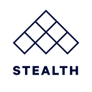

# Intro

## 

## What's Stealth?

Stealth is an open source,  Ruby framework for conversational voice and text chatbots.

Stealth is inspired by the Model-View-Controller (MVC) pattern. However, instead of calling them _Views,_ Stealth refers to them as _Replies_ to better match the chatbot domain.

* The [Model](models/overview.md) layer represents your data model (such as Account, User, Quote, etc.) and encapsulates the business logic that is specific to your bot. By default, Stealth uses [ActiveRecord](models/activerecord.md), but you can use any library that you prefer.
* The [Controller](controllers/controller-overview.md) layer is responsible for handling incoming requests from messaging platforms and providing and transmitting the response (reply).
* The [Reply](replies/reply-overview.md) layer is composed of “templates” that are responsible for constructing the respective reply.

In addition to being inspired by Model-View-Controller (MVC) pattern, Stealth has a few other awesome things built in for you.

* **Plug and play components.** Every service integration in Stealth is a Ruby gem. One bot can support multiple [messaging platforms](platforms/overview.md) (i.e. Facebook Messenger, SMS, Alexa, and more) and multiple NLP/NLU services.
* **Innovative.** Stealth is constantly improving and evolving. There are many innovations in Stealth such as: [interrupt detection](controllers/interrupt-detection.md), [homophone detection](controllers/handle\_message/homophone-detection.md), [hot-code reloading](dev-environment/hot-code-reloading.md), [multi-level catch-all handling](controllers/catch-alls.md), and more that make your bots perform better.
* **Advanced tooling.** From web servers to continuous integration testing, Stealth is built to take advantage of all the great work done by the web development community.
* **Hosting you trust.** Stealth bots are Rack applications. That means your bots can be [deployed](deployment/overview.md) using familiar services like Docker and Heroku.
* **Ready for production.** Stealth already powers bots for large, well-known brands. You can rest assured your bot will be in good hands with Stealth.
* **Open source.** Stealth is MIT licensed to ensure you own your bot's source code. More importantly, we welcome contributors to help make Stealth even better for everyone.

## Prerequisites

While it's helpful to have some familiarity with Ruby, we think you can get started with Stealth without yet knowing Ruby or even programming. Building text-based bots or Alexa Skills is a great starting point into the world of programming and we think Ruby is an excellent first programming language.

We welcome contributors and questions from programmers of all experience levels.
